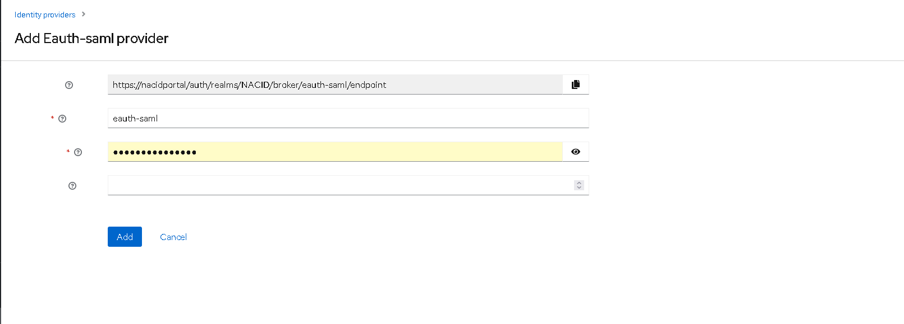
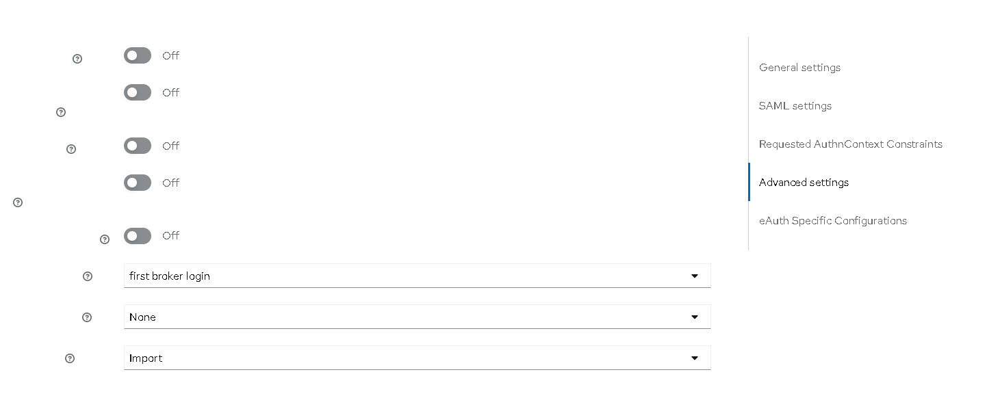
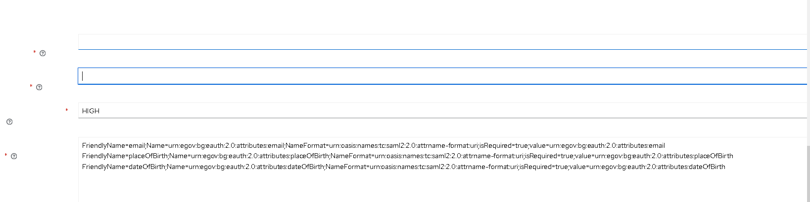
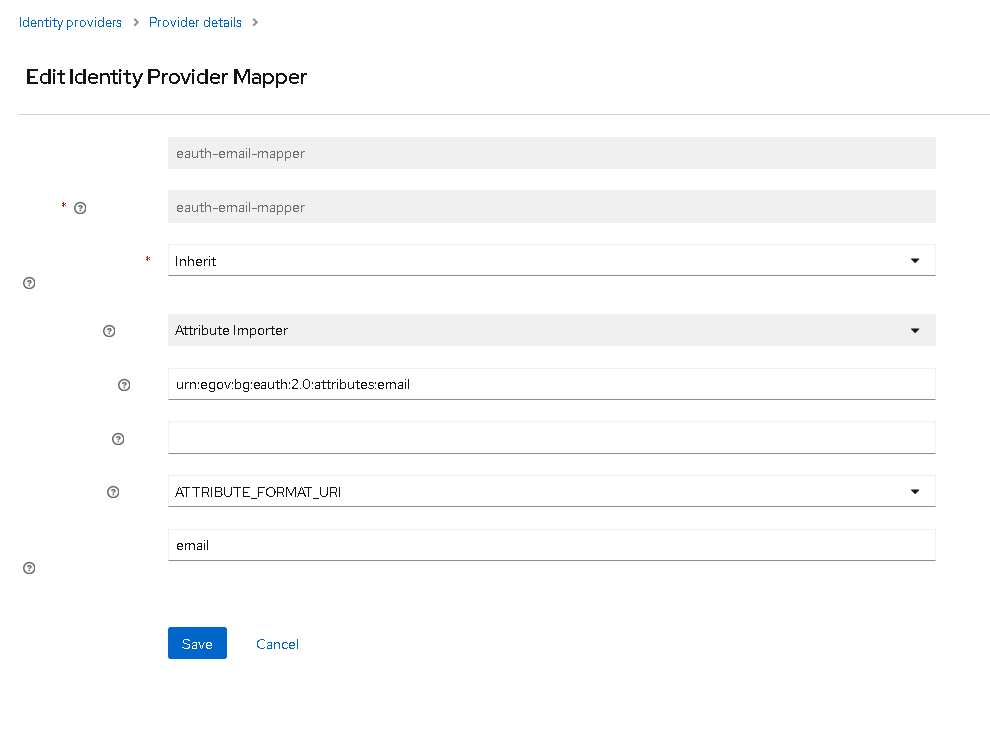
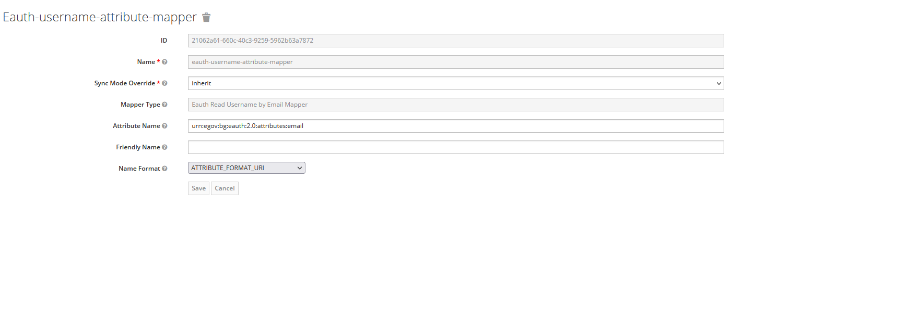
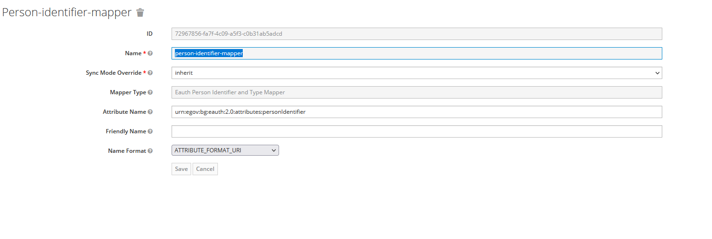

# eAuth.egov.bg as Keycloak Identity Provider

This is an extension for [Keycloak](https://www.keycloak.org/), which allows [eauth.egov.bg](https://eauth.egov.bg/) 
to be used like an identity provider.

The extension uses SAML 2.0 identity provider-a за keycloak and adds additional configurations, related to eAuth.

## Configurations
### Requirements
 - This extension is built for keycloak 21.0.0, but it might (or might not) work with new keycloak versions 

### Deployment
#### keycloak-eauth-idp
 - clone github repository -> https://github.com/georgiev-georgi/keycloak-eauth-idp
 - checkout branch 21.0.0
 - the code is getting compiled using java 8 (or newer) and maven. 
 - calling mvn clean install will generate keycloak-eauth-idp.jar file, located in the  target directory
 - the jar file should be copied to the keycloak's providers folder
 - call kc build inside the keycloak's bin dir
#### keycloak-ui
 - clone github repository -> https://github.com/georgiev-georgi/keycloak-ui
 - checkout branch 21.0.0
 - locate the folder keycloak-theme
 - call mvn clean install, which will create keycloak-admin-ui-21.0.0.jar inside the target folder.
 - rename the jar file to org.keycloak.keycloak-admin-ui-21.0.0.jar and replace the file with the same name inside lib/lib/main folder of keycloak
 - run the keycloak server

### Add and configure the  eAuth SAML idp
 - select Identity Providers
 - eAuth SAML 
 - add eAuth SAML, save 
 - General Settings 
 - SAML Settings
   - Service Provider Entity ID - The URL of the client's service descriptor, usually https://{keycloak.URL}/auth/realms/{REALM.NAME}/broker/eauth-saml/endpoint/descriptor
   - Single Sign On Service URL 
     - https://eauth-test.egov.bg/SingleSignOnService for the test environment
     - https://eauth.egov.bg/SingleSignOnService for the production environment
   - Allow Create - on
   - HTTP-POST binding  response - on
   - Want AuthnRequests signed - on
   - Principal Type - Attribute
   - Principal Attribute - urn:egov:bg:eauth:2.0:attributes:personIdentifier - now the personIdentifier will be used like principal Attribute. Either the personIdentifier or the urn:egov:bg:eauth:2.0:attributes:email should be used like principal attribute
   - Want Assertions Encrypted - on for production eAuth, off - for the test one
 - Requested AuthnContext Constraints - default settings 
 - Advanced Settings - default settings 
 - eAuth Specific Configurations 
   - Requested Service Provider - provided from eAuth.egov.bg
   - Requested Service Service - provided from eauth.egov.bg
   - Level Of Assurance - LOW / SUBSTANTIAL / HIGH
   - Requested Attributes - list of additional attributes, that might be returned from eAuth. The pattern for the additional attributes is attr1=value1;attr2=value2;value=value3 (each subattribute is separated by ; and each attribute by new line) 
     Example:
     FriendlyName=email;Name=urn:egov:bg:eauth:2.0:attributes:email;NameFormat=urn:oasis:names:tc:saml2:2.0:attrname-format:uri;isRequired=true;value=urn:egov:bg:eauth:2.0:attributes:email
     FriendlyName=placeOfBirth;Name=urn:egov:bg:eauth:2.0:attributes:placeOfBirth;NameFormat=urn:oasis:names:tc:saml2:2.0:attrname-format:uri;isRequired=true;value=urn:egov:bg:eauth:2.0:attributes:placeOfBirth
     - List of additional attributes
        - urn:egov:bg:eauth:2.0:attributes:personIdentifier
        - urn:egov:bg:eauth:2.0:attributes:personName
        - urn:egov:bg:eauth:2.0:attributes:email
        - urn:egov:bg:eauth:2.0:attributes:phone
        - urn:egov:bg:eauth:2.0:attributes:latinName
        - urn:egov:bg:eauth:2.0:attributes:birthName
        - urn:egov:bg:eauth:2.0:attributes:dateOfBirth
        - urn:egov:bg:eauth:2.0:attributes:gender
        - urn:egov:bg:eauth:2.0:attributes:placeOfBirth
        - urn:egov:bg:eauth:2.0:attributes:X509
        - urn:egov:bg:eauth:2.0:attributes:canonicalResidenceAddress
### Add and configure mappers (if necessary)
 - Email Mapper - maps the eAuth's email attribute to user's email attribute 
   - Mapper Type - Attribute Importer
   - Attribute Name - urn:egov:bg:eauth:2.0:attributes:email
   - Name Format - ATTRIBUTE_FORMAT_URI
   - User Attribute Name - email
 - Username Attribute Mapper - maps the username. If an user with the given name exists in the database, it's username is set to the field. If the user does not exist, the chars before @ are used as username 
   - Mapper Type - Eauth Read Username By Email Mapper
   - Attribute Name - urn:egov:bg:eauth:2.0:attributes:email
   - Name Format - ATTRIBUTE_FORMAT_URI
 - Person Identifier Mapper - reads the personIdentifier and if starts with PNOBG-, maps it to 2 attributes - personIdentifierType=NATIONAL_ID and personIdentifier=the chars after PNOBG- 
   - Mapper Type - Eauth Person Identifier And  Type Mapper
   - Attribute Name - urn:egov:bg:eauth:2.0:attributes:personIdentifier
   - Name Format - ATTRIBUTE_FORMAT_URI
 - Person Names Mapper - Reads the attribute urn:egov:bg:eauth:2.0:attributes:personName if has two spaces, it separated to 3 parts, each of them is set to firstName / secondName / lastName user attributes. Otherwise set the whole personName like firstName. 
   - Mapper Type - Eauth Person Names Attributes Mapper
   - Attribute Name - urn:egov:bg:eauth:2.0:attributes:personName
   - Name Format - ATTRIBUTE_FORMAT_URI