# eAuth.egov.bg като Keycloak Identity Provider

Това е добавка към [Keycloak](https://www.keycloak.org/), която позволява да се ползва [eauth.egov.bg](https://eauth.egov.bg/) 
като identity provider.

Добавката използва SAML 2.0 identity provider-a за keycloak, като добавя допълнителни конфигурации, касаещи eAuth.

## Конфигуриране
### Изисквания
 - тази добавка използва keycloak 21.0.0, като има шанс да работи и с други по-нови версии на keycloak. 

### Инсталиране
#### keycloak-eauth-idp
 - клониране на github repo -> https://github.com/georgiev-georgi/keycloak-eauth-idp
 - checkout на branch 21.0.0
 - кода се компилира с java 8 (или по-нова) и maven. 
 - извиква се mvn clean install, което генерира keycloak-eauth-saml-idp.jar file, който се намира в target директорията
 - jar file-a се копира в providers директорията на keycloak
 - извиква се kc build от bin директорията на keycloak
#### keycloak-admin-ui
1. build от sources или използване на съществуващия jar от директорията /jar
   - build на сорсовете
     - клониране на gitlab repo -> https://gitlab.com/duosoftbg/keycloak.git
     - checkout на branch 21.1.1
     - влизане в директорията js
     - mvn clean install, което създава keycloak-admin-ui-21.1.1.jar в apps\admin-ui\target директорията
     - jar-a се преименува на org.keycloak.keycloak-admin-ui-21.1.1.jar
   - използване на файла org.keycloak.keycloak-admin-ui-21.1.1.jar от /jar директорията
2. jar file-a се прехвърля в lib/lib/main директорията на keycloak, в която трябва да съществува същия файл, който се replace-ва 
3. стартиране на сървъра

### Добавяне и конфигуриране на eAuth SAML idp
 - от менюто в ляво се избира Identity Providers
 - eAuth SAML 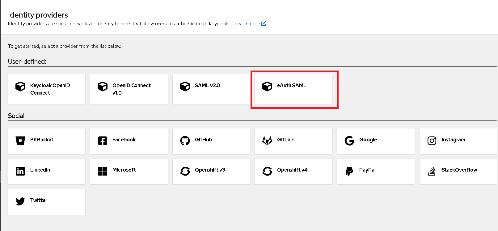
 - добавяне на eAuth SAML, запис 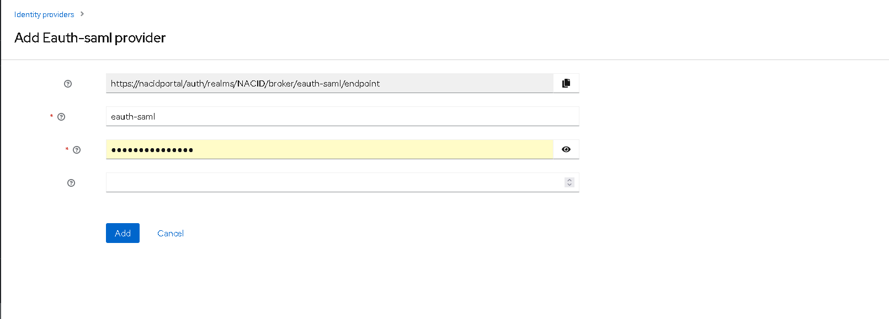
 - General Settings 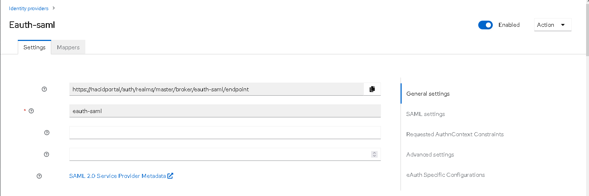
 - SAML Settings 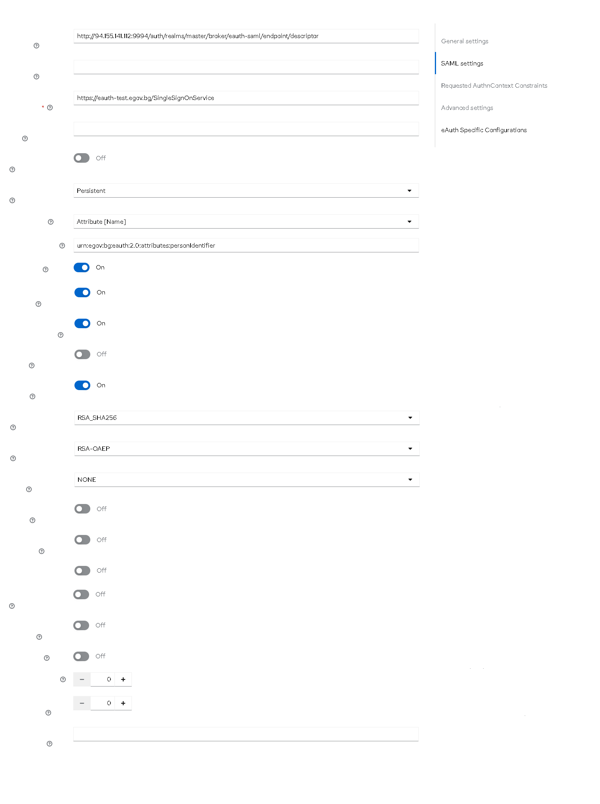
   - Service Provider Entity ID - URL-то където стои service descriptor-a на клиента, обикновено https://{keycloak.URL}/auth/realms/{REALM.NAME}/broker/eauth-saml/endpoint/descriptor
   - Single Sign On Service URL 
     - https://eauth-test.egov.bg/SingleSignOnService за тестовата среда
     - https://eauth.egov.bg/SingleSignOnService за production
   - Allow Create - on
   - HTTP-POST binding  response - on
   - Want AuthnRequests signed - on
   - Principal Type - Attribute
   - Principal Attribute - urn:egov:bg:eauth:2.0:attributes:personIdentifier - така personIdentifier-a се ползва като principal Attribute. На теория може да се ползва и urn:egov:bg:eauth:2.0:attributes:email
   - Want Assertions Encrypted - on за prod eAuth и off за тестовата среда
 - Requested AuthnContext Constraints - стандартните 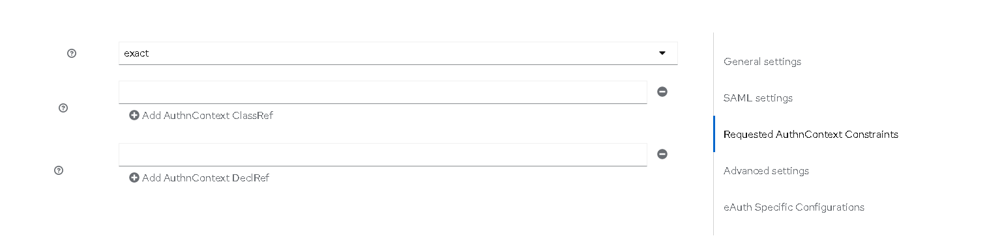
 - Advanced Settings - стандартните 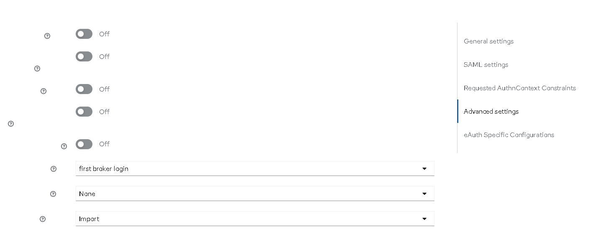
 - eAuth Specific Configurations 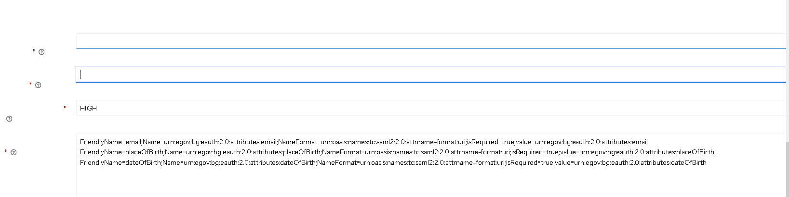
   - Requested Service Provider - параметър, предоставен от eAuth.egov.bg
   - Requested Service Service - параметър, предоставен от eauth.egov.bg
   - Level Of Assurance - една от стойностите LOW / SUBSTANTIAL / HIGH
   - Requested Attributes - списък от допълнителни атрибути, които да се върнат от eAuth. Изписват се във вида на attr1=value1;attr2=value2;value=value3 Податрибутите на всеки атрибут са разделени с ; докато атрибутите са разделени с нов ред
     Пример:
     FriendlyName=email;Name=urn:egov:bg:eauth:2.0:attributes:email;NameFormat=urn:oasis:names:tc:saml2:2.0:attrname-format:uri;isRequired=true;value=urn:egov:bg:eauth:2.0:attributes:email
     FriendlyName=placeOfBirth;Name=urn:egov:bg:eauth:2.0:attributes:placeOfBirth;NameFormat=urn:oasis:names:tc:saml2:2.0:attrname-format:uri;isRequired=true;value=urn:egov:bg:eauth:2.0:attributes:placeOfBirth
     - Списък с допълнителни атрибути
        - urn:egov:bg:eauth:2.0:attributes:personIdentifier
        - urn:egov:bg:eauth:2.0:attributes:personName
        - urn:egov:bg:eauth:2.0:attributes:email
        - urn:egov:bg:eauth:2.0:attributes:phone
        - urn:egov:bg:eauth:2.0:attributes:latinName
        - urn:egov:bg:eauth:2.0:attributes:birthName
        - urn:egov:bg:eauth:2.0:attributes:dateOfBirth
        - urn:egov:bg:eauth:2.0:attributes:gender
        - urn:egov:bg:eauth:2.0:attributes:placeOfBirth
        - urn:egov:bg:eauth:2.0:attributes:X509
        - urn:egov:bg:eauth:2.0:attributes:canonicalResidenceAddress
### Добаяне и конфигуриране на mappers (при необходимост)
 - Email Mapper - Map-ва email-a от eauth като email person attribute 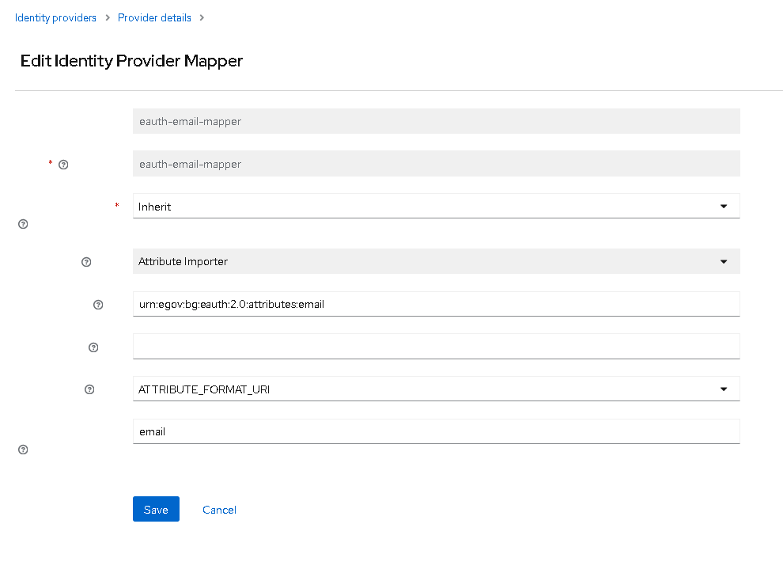
   - Mapper Type - Attribute Importer
   - Attribute Name - urn:egov:bg:eauth:2.0:attributes:email
   - Name Format - ATTRIBUTE_FORMAT_URI
   - User Attribute Name - email
 - Username Attribute Mapper - map-ва username атрибута. Слага дадения атрибут (в общия случай мейла като username) 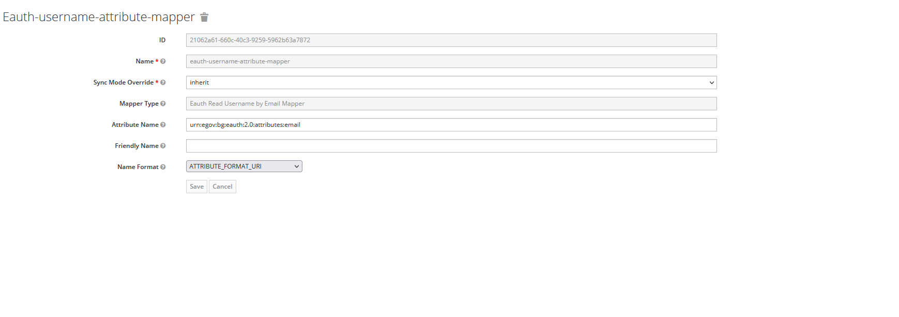
   - Mapper Type - Eauth Read Username By Email Mapper
   - Attribute Name - urn:egov:bg:eauth:2.0:attributes:email
   - Name Format - ATTRIBUTE_FORMAT_URI
 - Person Identifier Mapper - Прочита personIdentifier и ако започва с PNOBG- го map-ва към 2 атрибута personal_id_type=NATIONAL_ID + personal_id=това след PNOBG- 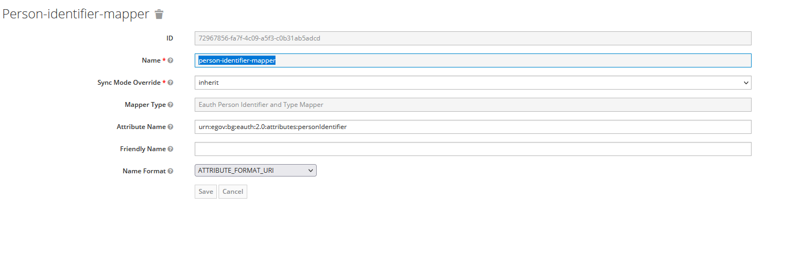
   - Mapper Type - Eauth Person Identifier And  Type Mapper
   - Attribute Name - urn:egov:bg:eauth:2.0:attributes:personIdentifier
   - Name Format - ATTRIBUTE_FORMAT_URI
 - Person Names Mapper - Прочита атрибута urn:egov:bg:eauth:2.0:attributes:personName и ако е сътавен от 3 части, слага всяка една част в атрибуте firstName, middle_name, lastName на user-a. Ако не може да го раздели на 3 части, слага всичко в personName. 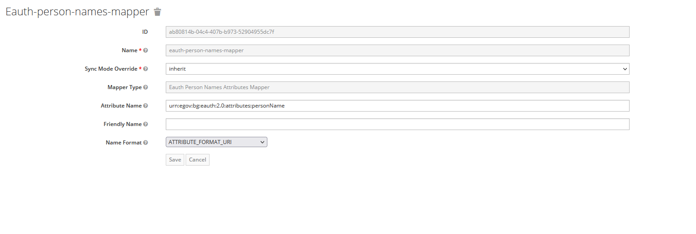
   - Mapper Type - Eauth Person Names Attributes Mapper
   - Attribute Name - urn:egov:bg:eauth:2.0:attributes:personName
   - Name Format - ATTRIBUTE_FORMAT_URI
### Промяна на authentication flow (при необходимост)
Authentication flow-a по подразбиране първо отваря страница за редактиране на потребителско име / mail / имена на потребител, попълнени с данни получени от eAuth, които могат да се коригират, 
след което или създава нов потребител с въведените данни и го връзва към подписа или връзва съществуващ потребител с въведения мейл / username, като кара потребителя да се аутентикира с паролата си.
В нашия конкретен случай ние не искаме да се създава потребител, ако той не съществува, а директно да се върже към съществуващ, е създаден следния Authentication flow-a 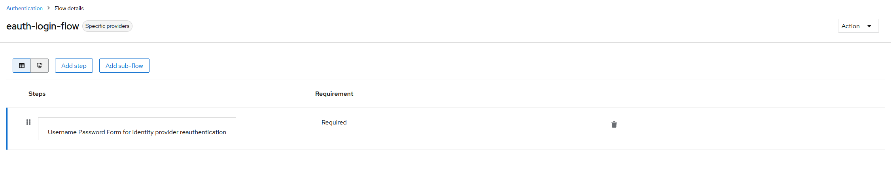
След което този flow е вързан към eauth saml identity provider-a - В редакцията му има поле "First login flow", където се избира текущо създадения eauth-login-flow
Така след препращане от eAuth към keycloak-a, се отваря страницата за аутентикиране на потребител, след което eAuth login-a се връзва към конкретен потребител в keycloak-a 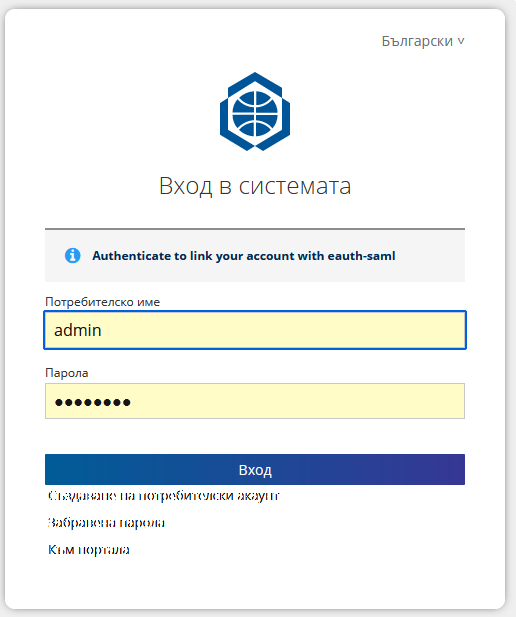
